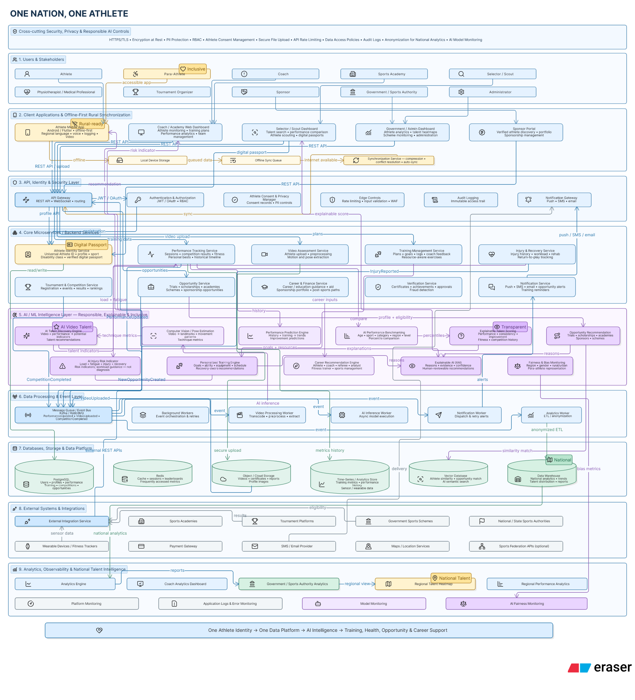

# One Nation, One Athlete

A unified athletic development, talent discovery, and sports performance platform featuring a **React 19 / Vite web client**, an **Express 5 REST API** with dual MongoDB Atlas / local storage, and a **native Kotlin Android mobile application**.



---

## Repository Structure

```text
.
├── frontend/                 # React 19 + Vite web application
│   ├── src/
│   │   ├── pages/            # Workspace views (Dashboard, VideoLab, Passport, etc.)
│   │   ├── components/       # Modals, forms, charts, navigation, and brand
│   │   ├── lib/              # API client, offline queue, MediaPipe pose detection
│   │   └── styles/           # Frame animations, design tokens, responsive styles
│   ├── public/
│   │   ├── 30Frames/         # Original frame sequence assets
│   │   └── frames/           # Optimized WebP animation frames
│   └── tests/                # Playwright end-to-end browser tests
│
├── backend/                  # Express 5 REST API service
│   ├── src/
│   │   ├── routes/           # Auth, athletes, records, opportunities, files
│   │   ├── services/         # Dual store (Mongo/JSON), rules engine, seed
│   │   └── middleware/       # JWT auth, sessions, cookies, rate limiting
│   ├── tests/                # Node test runner integration suite
│   └── .data/                # Local database fallback and file uploads
│
├── MobileApp/                # Native Kotlin Android application (API 24+)
│   ├── app/                  # Application code (Coroutines, OkHttp, Keystore)
│   ├── gradle/               # Gradle wrapper and build configuration
│   └── README.md             # Mobile-specific setup and architecture
│
├── 30Frames/                 # Original high-resolution sporting footage frames
├── sysarch.png               # High-level architecture diagram
├── package.json              # Root workspace coordinator
└── README.md                 # Project documentation
```

---

## Core Capabilities

- **Digital Athlete Passport & Profile**: Centralized sporting identity, verified milestones, competition records, granular privacy controls, and one-click JSON data export.
- **AI Motion & Pose Analysis (Video Lab)**: In-browser Google MediaPipe pose estimation extracting biomechanical joint angles, posture metrics, and movement symmetry from uploaded or recorded video.
- **Training & Calendar Log**: Session management, drill logs, intensity ratings, and offline queueing with idempotency keys for automatic background sync.
- **Performance & Recovery Monitoring**: Readiness assessments, sleep/soreness logs, wellbeing trends, and transparent return-to-play guidelines.
- **Opportunity & Sponsorship Engine**: Rule-based matching connecting athletes to trials, tournaments, and scholarships with clear eligibility explanations.
- **Financial & Career Tracking**: Transparent expense logging, receipt uploads, funding tracker, and career goal setting.
- **Role-Based Workspaces**: Dedicated perspectives for **Athletes**, **Coaches**, **Medical Specialists**, and **Event Organisers** with verification workflows and fairness metrics.
- **Native Android Companion**: Kotlin client with encrypted local storage (Android Keystore AES-GCM), native dashboards, offline session queuing, and media uploads.

---

## Quick Start

### Prerequisites

- **Node.js**: v22.12.0 or higher
- **npm**: v10.0.0 or higher
- *(Optional for Android)*: **Android Studio** (Koala / Ladybug or newer) with Android SDK 37 (API 24+ minimum), JDK 17+

### 1. Install & Run Everything (Root)

From the project root:

```bash
# 1. Install root dependencies and setup frontend & backend packages
npm install
npm run setup

# 2. Start both backend (port 4000) and frontend (port 5173) concurrently
npm run dev
```

- **Frontend App**: [http://localhost:5173](http://localhost:5173)
- **Backend API**: [http://localhost:4000](http://localhost:4000)
- **API Health Check**: [http://localhost:4000/api/health](http://localhost:4000/api/health)

Use the **Explore demo** button in the footer to create an isolated demo account instantly, or register a new Athlete, Coach, Medical Specialist, or Organiser account.

---

## Running Components Individually

### Backend

```bash
cd backend
npm install
npm run dev
```

The server starts on port `4000` with file watching enabled (`node --watch src/index.js`).

### Frontend

```bash
cd frontend
npm install
npm run dev
```

The Vite dev server starts on port `5173` and proxies `/api` calls to `http://localhost:4000`.

### Native Android Mobile App

1. Open the [`MobileApp`](MobileApp/) directory in **Android Studio**.
2. Let Gradle sync dependencies (Gradle 9.5, AGP 9.3.3).
3. Ensure the backend server is running (`npm start --prefix backend` or `npm run dev`).
4. On the welcome screen of the app, configure **Connection settings**:
   - **Android Emulator**: `http://10.0.2.2:4000` *(default)*
   - **Physical Device**: `http://<YOUR_COMPUTER_LAN_IP>:4000` *(same Wi-Fi network)*
   - **Production Backend**: `https://your-api-domain.com`
5. Build and run on your target device:

```bash
cd MobileApp
./gradlew :app:assembleDebug
# On Windows:
# gradlew.bat :app:assembleDebug
```

For more mobile details, see [MobileApp/README.md](MobileApp/README.md).

---

## Environment Configuration

### Backend (`backend/.env`)

Copy `backend/.env.example` to `backend/.env`:

```ini
PORT=4000
MONGODB_URI=mongodb+srv://<USER>:<PASSWORD>@<CLUSTER>/one_nation_one_athlete
JWT_SECRET=your_long_random_jwt_secret_key_here
APP_ORIGIN=http://localhost:5173
```

- **`MONGODB_URI`**: Optional. If omitted, the backend runs in standalone mode using a file-based JSON store at `backend/.data/database.json`. If provided, it connects to your MongoDB Atlas cluster.
- **`JWT_SECRET`**: Required in production. In development, a random persistent key is generated in `backend/.data/.secret` if left unset.
- **`APP_ORIGIN`**: The allowed origin for CORS cookies and credentials (e.g. `http://localhost:5173`).
- **`DATA_DIR`**: Optional custom directory for persistent database and file uploads (default: `backend/.data`).

### Frontend (`frontend/.env`)

Copy `frontend/.env.example` to `frontend/.env`:

```ini
# Development reverse proxy target
VITE_API_PROXY=http://localhost:4000

# Optional: direct API URL for production or custom hosted API
# VITE_API_BASE=https://your-api-domain.com
```

---

## Testing & Quality Assurance

### Backend Tests

Runs the native Node test runner test suite covering auth, records, opportunities, RBAC, and file uploads:

```bash
npm test
# Or directly from backend:
npm test --prefix backend
```

### Frontend Linting

```bash
npm run lint --prefix frontend
```

### End-to-End Browser Tests (Playwright)

With the dev server running:

```bash
# Install Chromium browser binaries if running for the first time
npm exec --prefix frontend -- playwright install chromium

# Run e2e tests
npm run test:e2e
```

### Android Tests

With an Android emulator or device connected:

```bash
cd MobileApp
./gradlew :app:connectedDebugAndroidTest
```

---

## Production Build & Deployment

### Build the Web Client

```bash
npm run build
```

This compiles optimized production assets to `frontend/dist`.

### Serve Production from Express

When `frontend/dist` exists, the Express backend automatically serves the production SPA:

```bash
npm run build
npm start --prefix backend
```

Access the combined application and API at `http://localhost:4000`.

---

## License & Attribution

This project is licensed under the MIT License.
Supplied sporting footage frames and reference materials are preserved under `30Frames/` and `sysarch.png`.

